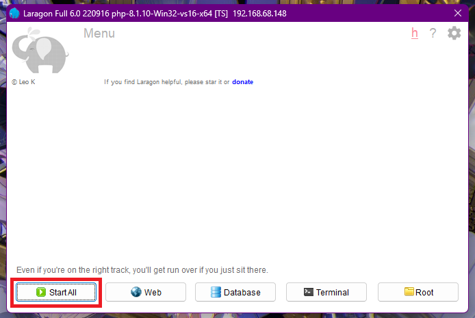
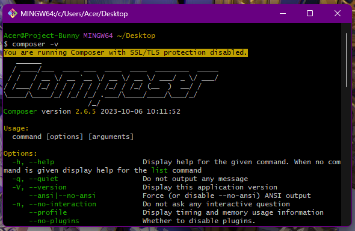

# Panduan Instalasi Laravel (Windows)

## 📌 Apa itu Laravel?

Laravel adalah salah satu framework PHP paling populer dan powerful yang digunakan untuk membangun aplikasi web modern secara cepat, elegan, dan efisien. Dibangun dengan prinsip MVC (Model-View-Controller), Laravel menyediakan berbagai fitur bawaan seperti routing, sistem autentikasi, manajemen database dengan Eloquent ORM, templating dengan Blade, sistem migrasi, serta Artisan CLI yang mempermudah pengembangan. Laravel juga didukung oleh ekosistem yang luas seperti Laravel Mix, Sanctum, dan Jetstream, serta komunitas yang aktif, sehingga sangat ideal untuk proyek skala kecil hingga besar. Framework ini dirancang untuk meningkatkan produktivitas developer dengan sintaks yang bersih dan dokumentasi yang lengkap.

---

## 🔧 Kebutuhan Instalasi

| Alat                   | Kegunaan                                                                      |
| ---------------------- | ----------------------------------------------------------------------------- |
| **Visual Studio Code** | Code editor yang digunakan untuk menjalankan laravel                          |
| **PHP**                | Bahasa pemrograman utama yang digunakan Laravel                               |
| **Composer**           | Manajer dependensi untuk PHP, digunakan untuk menginstal Laravel dan paketnya |
| **Laragon**            | Lingkungan server lokal ringan yang sudah termasuk PHP, MySQL, dll            |
| **Git** _(opsional)_   | Sistem kontrol versi, sering dibutuhkan oleh Composer saat mengunduh paket    |

---

## 🧱 Langkah-langkah Instalasi

### ✅ 1. Instal VSCode

- Unduh VSCode dari [https://visualstudio.org](https://code.visualstudio.com/download)


- Pilih versi yang sesuai dengan sistem operasi Anda. VS Code tersedia untuk Windows, Linux, dan macOS.
- Klik tombol download
- Setelah terdownload jalankan penginstal
- Ikuti langkah-langkah yang diberikan penginstal dan sesuaikan dengan kebutuhan anda
- Jalankan **VSCode**


### ✅ 2. Instal Laragon

- Unduh Laragon dari [https://laragon.org](https://laragon.org/download/)


- Buka aplikasi yang sudah kalian download tadi, yaitu laragon-wamp.exe.
- Klik 2x file laragon tersebut
- Jika ada pesan security, cukup klik **Run**
- Pilih bahasa English saja, lalu klik next terus bisa menggunakan pengaturan default yang sudah disediakan laragon atau kalian juga bisa mengubahnya sesuai kebutuhan
- klik install lalu tunggu beberapa menit dan aplikasi siap dijalankan



- Klik **Start All** untuk menjalankan laragon

### ✅ 3. Cek Instalasi PHP

Buka Command Prompt dan jalankan:

```bash
php -v
```

Contoh output:

```
PHP 8.1.10 (cli) (built: Aug  1 2022 20:17:19)
```


### ✅ 4. Instal Composer

- Unduh Composer dari [https://getcomposer.org](https://getcomposer.org)
  
- Instal seperti biasa (pastikan memilih path PHP dari Laragon saat instalasi)

Contoh path PHP jika menggunakan laragon:

```
C:\laragon\bin\php\php-8.1.10-Win32-vs16-x64\php.exe
```

- Cek instalasi Composer, buka terminal lalu jalankan perintah :

```bash
composer -V
```

Contoh output:

```
Composer version 2.x.x
```



### ✅ 5. Atur PATH PHP (Jika Diperlukan)

Jika `php -v` tidak berfungsi atau menunjukkan versi yang salah:

- klik **windows + s**
- Ketik **environment variabel** buka lalu buka **environment variabel**


- Klik **Path** terlebih dahulu lalu klik **edit**


- Klik **new**

- Tambahkan path PHP dari Laragon ke variabel lingkungan (menyesuaikan dengan path dan versi php yang kalian miliki):

  ```
  C:\laragon\bin\php\php-8.1.10-Win32-vs16-x64\
  ```


- Klik **ok** pada semua jendela environment variabel sampai semuanya terutup kembali

- Restart Command Prompt lalu jalankan

  ```
  php -v
  ```

### ✅ 6. Buat Proyek Laravel Baru

```bash
composer create-project laravel/laravel nama-proyek
```

Contoh:

```bash
composer create-project laravel/laravel kuliah-framework
```


- Klik **Enter** lalu tunggu sampai selesai

### ✅ 7. Jalankan Server Laravel

- Buka folder laravel yang kita download tadi menggunakan code editor
- klik **"ctrl" + " ` "** untuk membuka terminal di vscode

Jalankan perintah ini di terminal

```bash
php artisan serve
```


Buka browser dan akses:

```
http://127.0.0.1:8000
```


Jika halaman welcome Laravel muncul, maka instalasi berhasil ✅

---

## 🔍 Catatan Tambahan

- Pastikan ekstensi berikut aktif di file `php.ini`:
  ```ini
  extension=openssl
  extension=curl
  extension=zip
  ```
- Caranya buka file **php.ini**

contoh lokasi file **php.ini**

```
C:\laragon\bin\php\php-8.1.10-Win32-vs16-x64\php.ini
```

- Atau lebih mudah bisa mencari file **php.ini** dengan membuka laragon klik menu, klik php, dan klik php.ini


```
;extension=openssl
;extension=curl
;extension=zip
```

- klik **"ctrl" + "f"** untuk mencari ketiga ekstensi terbut
- hapus **";"** pada 3 ekstensi tersebut lalu save dan close


- `php artisan` adalah antarmuka command line Laravel
- Folder `vendor/` berisi semua paket yang diinstal melalui Composer

---

## ✅ Selesai!

Sekarang Laravel sudah berhasil diinstal dan siap digunakan di komputer lokal menggunakan Laragon.
